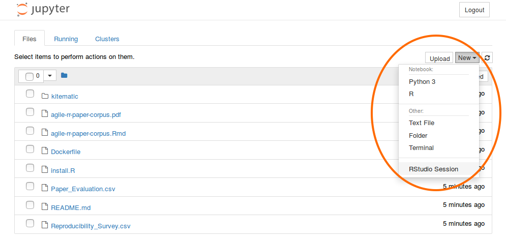
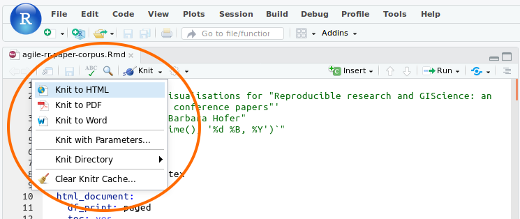
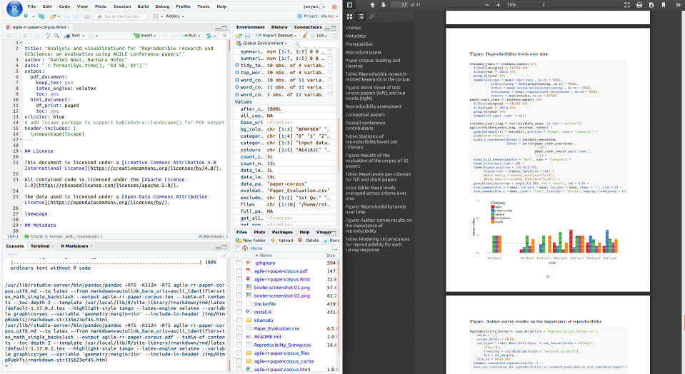

# Reproducible research and GIScience: Computational Environment

Ready to use R Markdown notebook for the paper "Reproducible research and GIScience: an evaluation using AGILE conference papers".

[](https://doi.org/10.7717/peerj.5072)

[](https://peerj.com/preprints/26561v1/)

[](https://doi.org/10.5281/zenodo.1227260)

## Reproduce Online

Click the "Binder" button below to open the notebook on [binder.org](https://mybinder.org/).

[](https://mybinder.org/v2/gh/nuest/reproducible-research-and-giscience/6)

On the Jupyter page that opens, select "New > RStudio".



In RStudio, open the file `agile-rr-paper-corpus.Rmd`, the _main analysis file_.

Then select "Knit > Knit to HTML" to render the document, which includes the complete analysis workflow, and display it in your browser.
You may use other output formats, like PDF, which is needed to create the figures for the original article.



For all analysis code to work you have to complete two prerequisite steps as described in the main analysis file:

- Configure a [Springer API](https://dev.springer.com/) key
- Upload data to the workspace (alternatively: download sample data, see main analysis file section "Data")

Without data and API key, not all some figures can be reproduced.



## Reproduce locally

Open the _main analysis file_ `agile-rr-paper-corpus.Rmd` with [RStudio](https://www.rstudio.com/products/rstudio/).
Then select "Knit > Knit to PDF" to render the document.
If you have errors rendering the whole PDF, try running each [chunk](https://rmarkdown.rstudio.com/authoring_rcodechunks.html) to locate the problem or use "Knit to HTML".

The document does _not_ include code to install required packages.
Run the code in the file `install.R` to install all dependencies.
You can skip the installation of `tinytex` and the LaTeX packages if you knit to HTML or run the chunks directly from RStudio.

## Reproduce locally with Docker

Install [Docker CE](https://www.docker.com/community-edition) or a compatible tool for building an image based on a `Dockerfile` and running a container based on the image.
Download the project files, open a command line in the root directory (where this file is), and run the following commands:

```bash
# build the image
docker build --tag rr-giscience .
# run the image
docker run -it -p 8888:8888 rr-giscience
```

Open a browser at http://localhost:8888 or click on the login link shown in the console.
It will show the Jupyter start page as shown in the first screenshot of the instructions in [Reproduce online](#reproduce-online), which you can use as described in that section.

## Reproduce locally with repo2docker

[Install](https://repo2docker.readthedocs.io/en/latest/install.html) [`jupyter-repo2docker`](https://github.com/jupyter/repo2docker) and run the following command:

```bash
repo2docker --ref 6 https://github.com/nuest/reproducible-research-and-giscience
```

You may also provide a [Springer API](https://dev.springer.com/) key as an environment variable:

```bash
repo2docker --ref 6 -e SPRINGER_API_KEY=<your key> https://github.com/nuest/reproducible-research-and-giscience
```

## Files in this repository

- `Paper_Evaluation.csv`: Results of manual paper evaluation.
- `Reproducibility_Survey.csv`: Anonymised responses of author survey.
- `agile-rr-paper-corpus.Rmd`: R Markdown document with the code to conduct the analysis and create the figures of the paper.
- `agile-rr-paper-corpus.pdf`: A PDF rendering or he analysis document for viewing.
- `Dockerfile`: A recipe for the computational environment using [Docker](https://en.wikipedia.org/wiki/Docker_(software)).
- `install.R`: R script file executed during creation of the Docker image to install required dependencies.
- `agile-rr-yearly-textanalysis.Rmd`: R Markdown notebook for text analysis of all AGILE submissions, online available at [https://rpubs.com/nuest/reproducible-agile-text-analysis](https://rpubs.com/nuest/reproducible-agile-text-analysis)

## Deposition on Zenodo

This repository is archived on Zenodo: [https://doi.org/10.5281/zenodo.1227260](https://doi.org/10.5281/zenodo.1227260)

The Zenodo repository includes the complete git repository so that readers may investigate the history of the analysis starting with [the supplemental information of the PeerJ preprint](https://peerj.com/preprints/26561/#supplementary-material).

The deposited archive was created based on the tag `6` (matching the Zenodo version number) with the following commands:

```bash
git clone https://github.com/nuest/reproducible-research-and-giscience.git
cd reproducible-research-and-giscience
git checkout 6
zip -r reproducible-reserach-and-giscience.zip .
```

The only discrepancy in Zenodo versions and tags is the tag `6` which maps to version `6-fixed` on Zenodo, and the tag `6-unfixed` which maps to Zenodo version `6`, see [#7](https://github.com/nuest/reproducible-research-and-giscience/pull/7) for changes.

## License

The documents in this repository are licensed under a [Creative Commons Attribution 4.0 International License](https://creativecommons.org/licenses/by/4.0/).

All contained code is licensed under the [Apache License 2.0](https://choosealicense.com/licenses/apache-2.0/).

The data used is licensed under a [Open Data Commons Attribution License](https://opendatacommons.org/licenses/by/).
